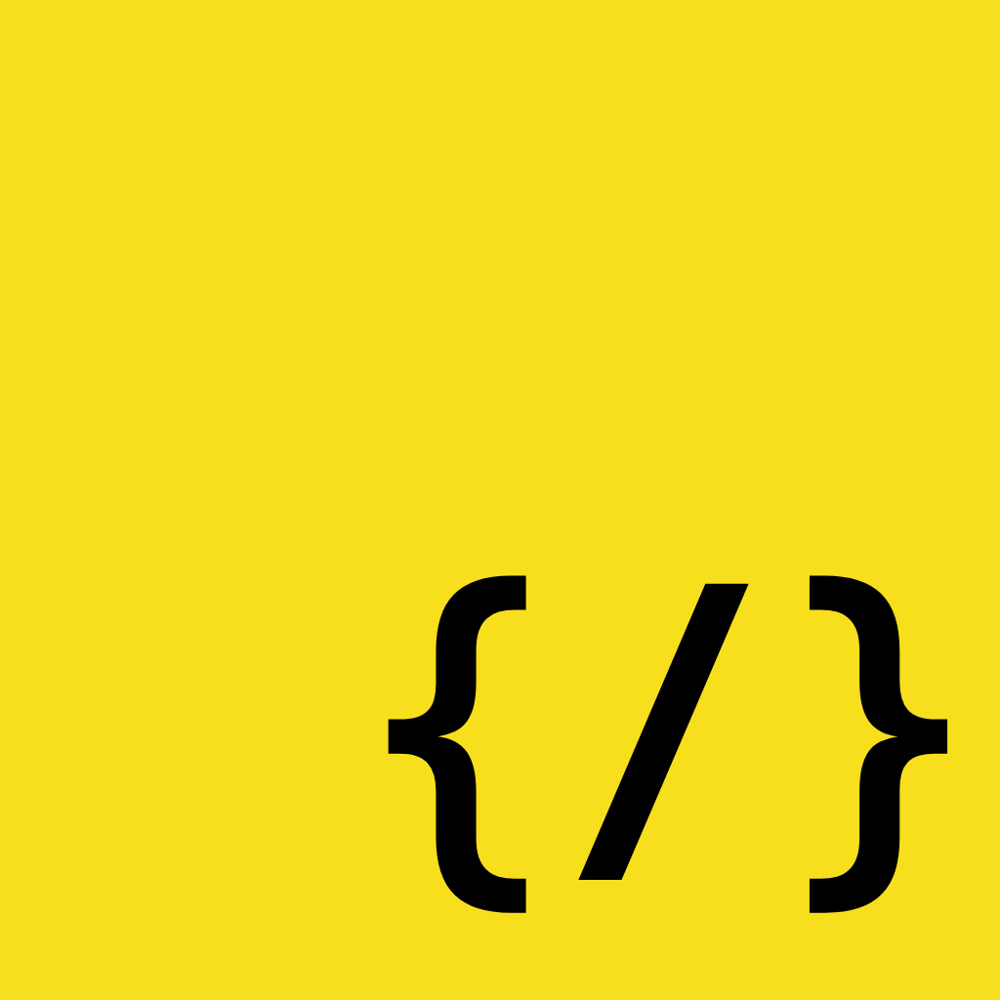

<p align="center">
  
</p>

<div align="center">
  <a href="https://github.com/andrewdku/guilds.js">GitHub</a> | 
  <a href="https://npmjs.com/package/guilds.js">npm</a>
</div>
<h1 align="center">guilds.js</h1>

> Interact with Discord's API with ease

## Installation

```bash
npm install guilds.js
# or
yarn add guilds.js
# or
pnpm add guilds.js
# or
bun add guilds.js
```

## Example

```js
import { Client } from "guilds.js";

const client = new Client({
    // https://discord.com/developers/applications
    token: "bot token",

    // client intents (as a number)
    intents: 0,
});

client.once("ready", () => {
    console.log("Client is ready!");
});

// start connection to Discord gateway
client.connect();
```

# Contributing

[pnpm](https://pnpm.io) is used throughout this project for packages and scripts. Pull requests are always welcome. For major changes, please open an issue to discuss what you wish to change.

# License

guilds.js is licensed under the [Apache 2.0 license](LICENSE).
